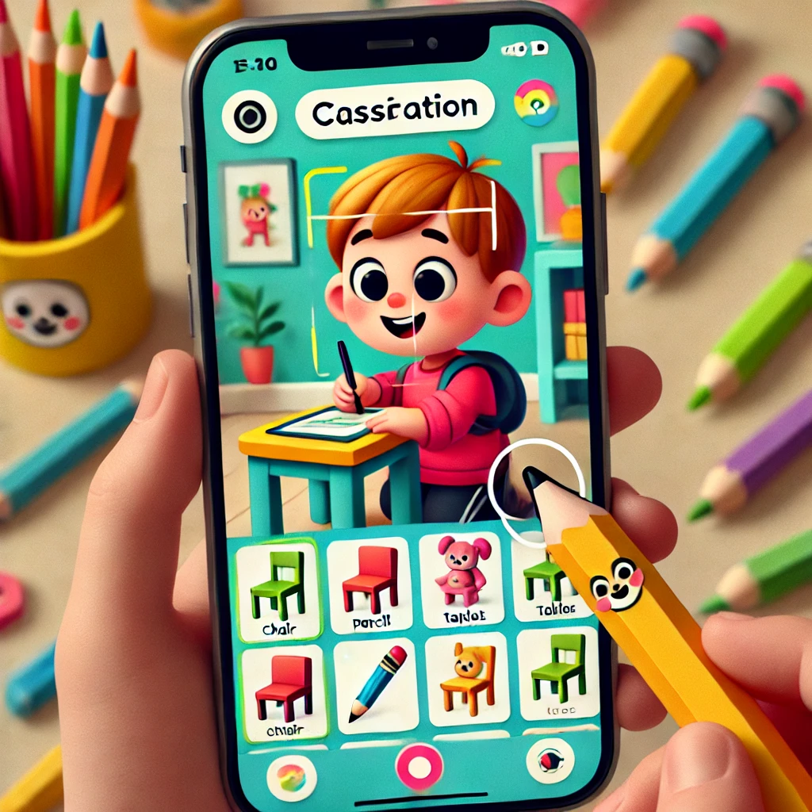
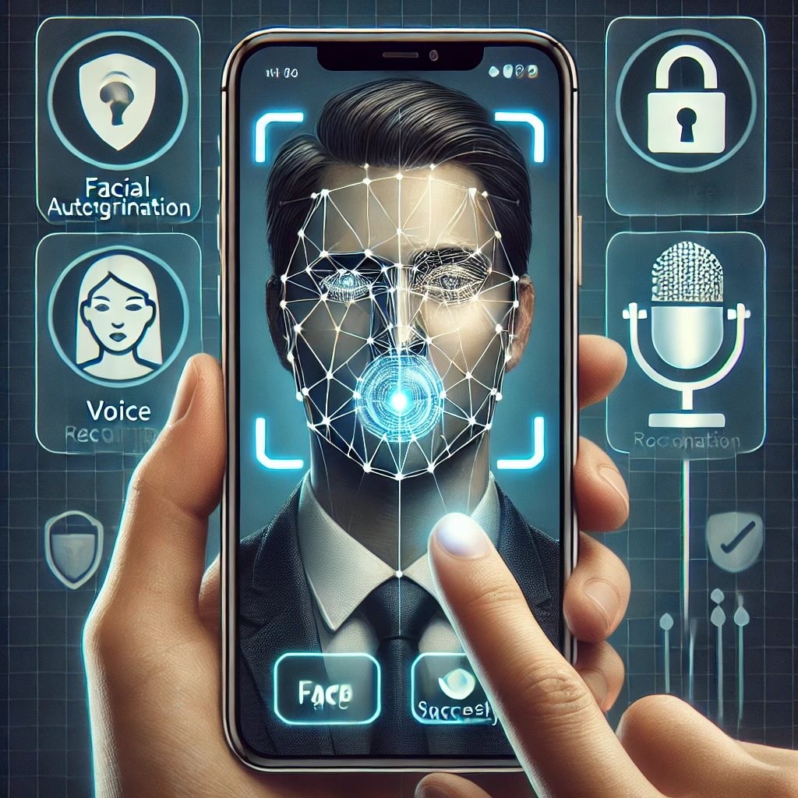

# Idée de projet TSM-MachLeData

## Aspect MLOPS abordé: **Collecte de données**

L'aspect MLOps visé est l'intégration d'un processus de **collecte de données pour le réentraînement**. Comment collecter les nouvelles données? Comment les ingérer ? Comment préannoter? Comment vérifier la qualité des annotations ? Comment intégrer et versionner les nouvelles données dans le processus de développement du modèle ?

Il s'agit de mettre en place un processus d'intégration de nouvelles données au sein du pipeline de MLOps. Cela peut inclure la collecte de données en continu, la vérification de la qualité des données, l'annotation des données, et l'intégration des nouvelles données dans le processus de réentraînement du modèle.

## 1. **Reconnaissance Vocale d'Ordres Simples (Classification)**

### Description

L'application de reconnaissance vocale d'ordres simples est une solution technologique permettant à des utilisateurs de contrôler des objets ou des appareils via des commandes vocales. Ce type d'application est utile dans divers contextes : maison connectée (allumer la lumière, ouvrir les volets), assistants vocaux (Google Assistant, Siri), et même pour l'accessibilité aux personnes en situation de handicap. Grâce à une approche de **classification**, elle détecte et interprète des commandes vocales spécifiques pour automatiser certaines actions.

    

### Méthodologie de collecte des données

Les utilisateurs sont invités à enregistrer eux-mêmes des exemples de commandes vocales simples et définies telles que "allumer la lumière", "éteindre", etc. Ces enregistrements sont ensuite labellisés selon la commande correspondante. Plus les utilisateurs enregistrent de commandes dans différents environnements sonores (par exemple, bruits de fond), plus le modèle devient robuste.

### Modèle ML

Un modèle **RNN basique** ou **CNN appliqué aux spectrogrammes audio** sera utilisé pour classer les commandes vocales. Le RNN (Réseau de Neurones Récurrent) est adapté à ce type de séquences temporelles (audio), mais un CNN peut également être efficace en analysant des images des spectrogrammes extraits des échantillons audio.

### Application

L'application doit permettre d'enregistrer des nouvelles données, et à partir d'un audio trouver la commande souhaitée.

### Description de l'application

L'application de reconnaissance vocale d'ordres simples permet aux utilisateurs de contrôler divers appareils via des commandes vocales spécifiques. Elle est conçue pour être utilisée dans des environnements tels que les maisons connectées, les assistants vocaux, et pour l'accessibilité des personnes en situation de handicap. Grâce à une approche de classification, l'application détecte et interprète les commandes vocales pour automatiser des actions quotidiennes.

## 2. **App d’Entraînement pour Identifier des Objets (Classification)**

### Description

Cette application vise à aider les enfants à apprendre à identifier des objets du quotidien à l’aide d’un appareil photo de téléphone. Les enfants capturent des images d’objets simples (chaise, table, stylo, etc.), et l’application tente de les classer dans des catégories prédéfinies. Cela permet une interaction ludique tout en utilisant des technologies d’**apprentissage supervisé** pour améliorer les performances de classification des objets.

    

### Méthodologie de collecte des données

L’application invite les enfants à prendre des photos de divers objets, qui sont automatiquement labellisés. Les données peuvent être collectées en continu, avec des options pour corriger manuellement les erreurs de classification pour affiner les performances du modèle. Chaque interaction enrichit progressivement la base de données d'objets.

### Modèle ML

Un **CNN (Convolutional Neural Network)** basique sera utilisé pour classer les images des objets dans différentes catégories. Les CNN sont largement utilisés dans les tâches de classification d'images en raison de leur capacité à identifier des motifs complexes dans les données visuelles.

### Application

L'application doit offrir une interface intuitive permettant aux enfants de prendre des photos d'objets. Chaque objet pris en photo sera comparé à une base de données et classé dans la bonne catégorie. Si le modèle se trompe, l’enfant ou un adulte peut corriger la prédiction, ce qui enrichit le dataset et améliore les performances du modèle. L'application peut être utilisée de deux manières. Premièrement, le mode création de donnée: Les utilisateurs prennent des photos d'objets pour enrichir la base de données avec de nouveaux exemples, améliorant ainsi le modèle de classification. Deuxièemement, le mode inférence: L'application reconnaît et classe les objets en temps réel, permettant aux utilisateurs de vérifier et corriger les prédictions si nécessaire.

## 3. **Double Authentification par Tête et Voix (Multimodal)**

### Description

L'application de double authentification utilise à la fois la reconnaissance faciale et vocale pour authentifier un utilisateur. Ce mode d’authentification est de plus en plus utilisé dans des systèmes de sécurité avancés, notamment pour les accès sensibles ou les transactions financières. L'utilisation de deux modalités (tête et voix) permet de renforcer la sécurité.

    

### Méthodologie de collecte des données

Chaque tentative de connexion enregistre une photo du visage et un échantillon vocal. Après chaque essai d'authentification, l’image et l’audio sont stockés pour analyse et entraînement du modèle. Chaque succès et échec améliore la performance du système en ajoutant de nouveaux exemples au dataset.

### Modèle ML

Le modèle combine un **CNN** pour la reconnaissance faciale et un **RNN** ou **CNN** pour la reconnaissance vocale. Le modèle multimodal intègre les deux sorties pour décider si l'utilisateur est authentifié. Cette fusion permet de vérifier si les deux identifications (visuelle et vocale) correspondent pour valider l’accès.

### Application de collecte

L'application d'authentification multimodale permet d'enregistrer une courte vidéo de l'utilisateur, capturant à la fois la voix et l'image. Lors de chaque tentative de connexion, l'application authentifie l'utilisateur en comparant les nouvelles données avec celles déjà enregistrées. Si l'utilisateur est reconnu, l'accès est accordé; sinon, il est refusé.

#### Fonctionnalités

- **Enregistrement Vidéo et Audio**: Capture simultanée de la voix et de l'image de l'utilisateur pour une authentification sécurisée.
- **Authentification en Temps Réel**: Analyse instantanée des données pour vérifier l'identité de l'utilisateur.
- **Enregistrement de Nouveaux Utilisateurs**: Possibilité d'ajouter de nouveaux utilisateurs en enregistrant un extrait vidéo et audio.
