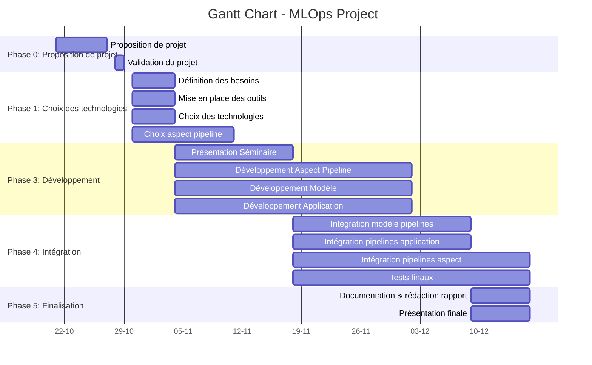

# Projet : Développement mutualisé d'une pipeline MLOps pour une application d'authentification par reconnaissance faciale et vocale

## 1. Intention du projet

Ce projet vise à mutualiser le développement d'une pipeline MLOps pour une application d'authentification par reconnaissance faciale et vocale. L'équipe 1 (HEIG-VD IAI) développera un environnement de développement pour la Data Science avec une pipeline MLOps de niveau 2, tandis que l'équipe 2 (Master TSM_MAchLeData) créera l'application d'authentification en intégrant un réentraînement continu via une pipeline MLOps de niveau 3. L'objectif est d’optimiser les ressources en collaborant étroitement et en assurant une cohérence globale.

## 2. Objectif principal du projet (Livrable)

### Équipe 1 : HEIG-VD IAI

**Objectif :** Développer un environnement de développement pour la Data Science intégrant une pipeline MLOps de niveau 2, permettant de simplifier et d'accélérer le processus de développement de modèles de machine learning.

**Critères d'évaluation :**

- **Gain de temps** : Mesuré par la réduction du temps de développement (heures économisées).
- **Reproductibilité** : Capacité à reproduire les expériences (nombre de reproductions réussies).
- **Facilité d'utilisation** : Évaluée par des enquêtes de satisfaction auprès des utilisateurs.
- **Robustesse** : Nombre minimal de bugs ou d'interruptions.
- **Automatisation** : Pourcentage de projet automatisé.

**Valeur ajoutée :** Accélérer le développement de modèles tout en assurant leur qualité et leur traçabilité.

### Équipe 2 : Master TSM_MAchLeData

**Objectif :** Développer une application d'authentification par reconnaissance faciale et vocale, intégrant une pipeline MLOps de niveau 3 pour le réentraînement automatique du modèle avec de nouvelles données.

**Critères d'évaluation :**

- **Réentraînement automatique** : Temps entre l'ajout de nouvelles données et le réentraînement effectif.
- **Précision du modèle** : Taux de faux positifs et négatifs.
- **Intégration des utilisateurs** : Simplicité du processus d'ajout de nouveaux utilisateurs.
- **Performance de l'application** : Temps de réponse et stabilité.

**Valeur ajoutée :** Offrir une solution d'authentification sécurisée, évolutive et adaptative aux nouveaux utilisateurs et données.

## 3. Mission de l'équipe de projet

### Mission Équipe 1 : HEIG-VD IAI

**Accélération du développement :** L'équipe 1 doit assurer un processus accélérant le développement, par divers moyens tels que l'automatisation des tâches répétitives, la mise en place d'une infrastructure, la mise à disposition des infrastructures de calculs et la mise en place d'un onboarding efficace.

**Amélioration de la qualité :** L'équipe 1 doit également veiller à l'amélioration de la qualité des modèles produits, en mettant en place des outils de suivi des performances, des tests automatisés, et en facilitant la reproductibilité des expériences.

### Mission Équipe 2 : Master TSM_MAchLeData

**Développement d'un aspect de la pipeline MLOps :** L'équipe 2 doit développer un aspect de la pipeline MLOps, en l'occurrence le réentraînement automatique du modèle avec de nouvelles données.

**Développement de l'application :** L'équipe 2 doit également développer l'application d'authentification, en intégrant la pipeline MLOps, en assurant la sécurité des données et en garantissant la facilité d'utilisation pour les utilisateurs finaux.

**Développement de la pipeline MLOps :** L'équipe 2 doit également veiller à la mise à niveau de la pipeline MLOPS au niveau 3.

## 4. Concept opérationnel

**Phases d'utilisation :**  

1. Collecte des données (faciale et vocale)
2. Prétraitement
3. Entraînement initial
4. Déploiement du modèle
5. Authentification
6. Collecte continue de nouvelles données
7. Réentraînement automatique
8. Surveillance des performances

**Cycle de vie :** Développement → Déploiement → Utilisation → Réentraînement → Mise à jour → Maintenance

**Parties prenantes :** équipes de Data Scientists, Data Engineer, Software Developers, utilisateurs finaux, gestionnaires de projet

## 5. Architecture fonctionnelle

### Fonctions requises

- Collecte et stockage sécurisé des données avec MinIO
- Prétraitement automatisé
- Entraînement du modèle (Keras + PyTorch)
- Suivi des expériences (MLFlow)
- Orchestration des pipelines (Kubeflow)
- Stockage des modèles (MLFlow)
- Déploiement du modèle en production (KServe)
- Réentraînement automatique avec nouvelles données
- Interface utilisateur pour l'authentification
- Gestion des utilisateurs

## 6. Work Breakdown Structure (WBS)

### Équipe 1 : HEIG-VD IAI

- WP1 : Choix des technologies (niveau 2)
- WP2 : Développement pipeline MLOps (Intégration MLFLOW, MinIO, Kubeflow, Test)

### Équipe 2 : Master TSM_MAchLeData

- WP1 : Choix des technologies (niveau 3)
- WP2 : Développement pipeline MLOps (KServe, réentraînement, tests, suivi)
- WP3 : Développement de l'application (Interface, modules de reconnaissance, tests)
- WP4 : Développement du modèle (Collecte/prétraitement, entraînement, évaluation)
- WP5-8 : Intégration et documentation, avec présentation finale

## 7. Phases du projet et milestones

### Phases et Milestones

0. **Proposition de projet** (Semaine 0) : Validation du projet
1. **Définition des besoins** (Semaine 1) : Validation des besoins
2. **Choix des technologies** (Semaine 2) : Sélection des pipelines MLOps
3. **Développement Aspect Pipeline** (Semaines 3-6) : Présentation réentraînement automatique
4. **Développement pipelines** (Semaines 3-6) : Pipelines MLOps fonctionnelles niveau 2 et 3
5. **Dév modèle et application** (Semaines 3-6) : Modèle de reconnaissance et application d'authentification
6. **Intégration et tests** (Semaines 6-7) : Intégration système, validation et tests finaux
7. **Documentation et présentation** (Semaine 8) : Rapport et présentation finale

## 8. Flux d'actions principales

## 8. Diagramme de Gantt

## 10. Organisation de l'équipe

### Équipe 1 : HEIG-VD IAI

- Olivier D'Ancona : 👨‍💼 Chef de projet
- Arnaud Maillard : 🛠️ Développeur Pipeline MLOps

### Équipe 2 : Master TSM_MAchLeData

- Olivier D'Ancona : 🤝 Coordination inter-équipes, Développeur Pipeline MLOps
- Badr Boucherine : 🚀 Pipeline MLOps niveau 3
- Géraud Silvestri : 💻 Développement application
- Yann Zübrugg : 🧠 Développement modèle DL
- Magali Egger : 📊 Analyse, rapport, intégration

## 11. Méthodes et outils de gestion

Méthodes : Scrum (sprints hebdomadaires), Kanban (visualisation des tâches)
Outils : GitHub, Teams, PowerPoint

## 12. Chiffrage des ressources

Ressources humaines : 48 personnes-semaines (8 semaines, 6 personnes)
Ressources matérielles : Ordinateurs, serveurs/cloud
