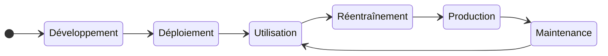
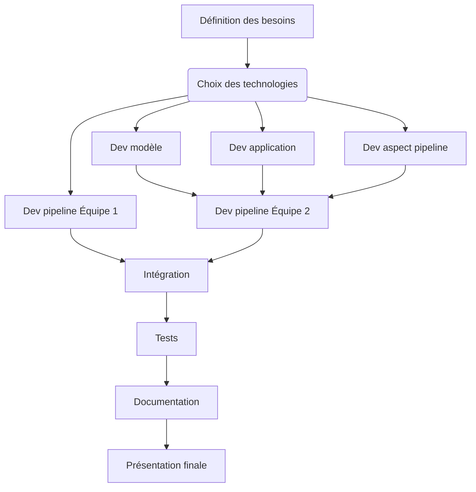
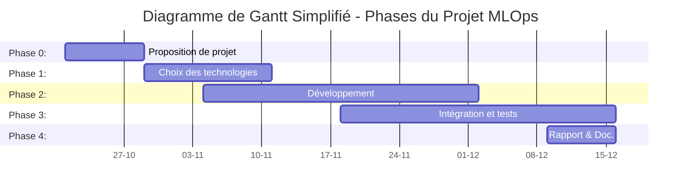

# Projet : Développement mutualisé d'une pipeline MLOps pour une application d'authentification par reconnaissance faciale et vocale

## 1. Intention du projet

Ce projet vise à **mutualiser le développement d'une pipeline MLOps** pour une application d'authentification par reconnaissance faciale et vocale entre deux équipes.

L'équipe 1 basée au sein de l'institut d'automatisation industrielle de la HEIG-VD développera un environnement de développement pour la Data Science avec une pipeline MLOps de niveau d'autonomie 2.

L'équipe 2 du cours de master TSM_MAchLeData intégrera un réentraînement continu du modèle dans la pipeline MLOps, portant ainsi celle-ci au niveau d'autonomie 3 dans le cadre de l'application d'authentification.

## 2. Objectif principal du projet (Livrable)

### Équipe 1 : HEIG-VD IAI

**Objectif** : Développer un environnement de développement pour la Data Science intégrant une pipeline MLOps de niveau 2, permettant de simplifier et d'accélérer le processus de développement de modèles de machine learning.

**Critères d'évaluation** :

- **Gain de temps** : Mesuré par la réduction du temps de développement (heures économisées).
- **Reproductibilité** : Capacité à reproduire les expériences développées dans le passé (couverture du nombre d'experience passées).
- **Facilité d'utilisation** : Évaluée par des enquêtes de satisfaction auprès des utilisateurs.
- **Robustesse** : Nombre minimal de bugs ou d'interruptions (uptime).
- **Automatisation** : Pourcentage de projet de l'institut automatisé.

**Valeur ajoutée** : Accélérer le développement de modèles tout en assurant leur qualité et leur traçabilité.

### Équipe 2 : Master TSM_MAchLeData

**Objectif** : Développer une application d'authentification par reconnaissance faciale et vocale, intégrant une pipeline MLOps de niveau 3 pour le réentraînement automatique du modèle avec de nouvelles données.

**Critères d'évaluation** :

- **Réentraînement automatique** : Capacité à réentraîner le modèle automatiquement à partir de nouvelles données.
- **Précision du modèle** : Meilleur modèle déployé en production automatiquement.
- **Intégration des utilisateurs** : Simplicité du processus d'ajout // de suppressions de nouveaux utilisateurs.

**Valeur ajoutée** : Développement d'une preuve de concept de pipeline MLOps de niveau 3

## 3. Mission des équipes de projet

### Mission Équipe 1 : HEIG-VD IAI

**Accélération du développement** : L'équipe 1 doit garantir un processus favorisant une accélération du développement en automatisant les tâches répétitives, en mettant en place une infrastructure adaptée, en fournissant des ressources de calcul, et en établissant un onboarding efficace.

**Amélioration de la qualité** : L'équipe 1 doit également veiller à l'amélioration de la qualité des modèles produits, en mettant en place des outils de suivi des performances, des tests automatisés, et en facilitant la reproductibilité des expériences.

### Mission Équipe 2 : Master TSM_MAchLeData

**Développement d'un aspect de la pipeline MLOps** : L'équipe 2 doit développer un aspect de la pipeline MLOps, en l'occurrence le réentraînement automatique du modèle avec de nouvelles données.

**Développement de l'application** : L'équipe 2 doit également développer l'application d'authentification, en intégrant la pipeline MLOps.

**Développement de la pipeline MLOps** : L'équipe 2 doit également veiller à la mise en oeuvre totalement fonctionnelle d'une pipeline MLOPS au niveau 3.

## 4. Concept opérationnel

### Contexte et Enjeux

Le projet vise à mettre en place une solution d'authentification biométrique par reconnaissance faciale et vocale, en intégrant une pipeline MLOps pour assurer un cycle de vie automatisé des modèles d'IA. Cette solution s'appuie sur une collaboration entre deux équipes:

- L'équipe 1 (HEIG-VD IAI) pour établir un environnement Data Science de base avec une pipeline MLOps de niveau 2.
- L'équipe 2 (TSM_MAchLeData) pour implémenter des fonctionnalités de réentraînement continu, portant la pipeline au niveau d'autonomie 3.

### Phases d'utilisation  

1. Collecte initiale de données : Acquisition des données faciales et vocales des utilisateurs.
2. Prétraitement : Filtrage, normalisation, et transformation des données pour les rendre exploitables par les modèles de machine learning.
3. Entraînement initial : Création d'un modèle de base pour la reconnaissance faciale et vocale.
4. Déploiement : Mise en production de la première version du modèle pour l'authentification des utilisateurs.
5. Authentification : Utilisation du modèle pour authentifier les utilisateurs en production.
6. Collecte continue de données : Récupération continue de nouvelles données d'authentification pour enrichir l'entraînement.
7. Réentraînement automatique : Amélioration continue du modèle en intégrant les nouvelles données (niveau 3).
8. Surveillance et suivi des performances : Évaluation des performances en production et ajustements en fonction des résultats.

### Cycle de vie

Le cycle de vie de l'application consiste à déployer un modèle, puis de l'améliorer constamment.

### Parties prenantes

Les parties prenantes sont: équipes de Data Scientists, Data Engineer, Software Developers, utilisateurs finaux, gestionnaires de projet.

## 5. Architecture fonctionnelle

### Fonction Pipeline MLOps (Niveau 2)

- Suivre les expériences de manière centralisée pour traçabilité
- Automatiser l'entraînement des modèles pour simplifier le développement
- Assurer la reproductibilité des modèles grâce à un historique des expérimentations
- Gérer et versionner les modèles pour une meilleure supervision
- Réaliser des tests et validations automatiques pour fiabilité et stabilité

### Fonction Pipeline MLOps (Niveau 3)

- Automatiser les déploiements en production pour réduire les délais
- Surveiller les performances des modèles en production pour optimiser les résultats
- Déployer des tests A/B pour comparer différentes versions de modèles
- Collecter continuellement les nouvelles données pour adapter les modèles
- Réentraîner automatiquement les modèles avec les nouvelles données
- Gérer les utilisateurs, y compris les ajouts et suppressions
- Assurer la traçabilité complète des modèles et des données associées

### Fonctionnalités de l'application

- Authentifier les utilisateurs par reconnaissance faciale et vocale
- Envoyer une vidéo pour vérification via une API
- Recevoir la réponse de l'API pour confirmer ou refuser l'accès
- Ajouter un nouvel utilisateur pour permettre son authentification
- Supprimer un utilisateur de la base de données

### Fonctionnalités du modèle

- Le modèle "caractériseur" doit être capable de prendre une vidéo et de générer un vecteur de caractéristiques
- Le modèle "discriminateur" doit être capable de prendre un vecteur de caractéristiques et de renvoyer l'utilisateur correspondant

### Fonctionnalités de l'aspect de réentraînement

- Ingestion des données
- Prétraitement automatisé
- Comparaison du modèle actuel avec les précédents
- Déploiement du modèle en production
- Réentraînement automatique avec nouvelles données

## 6. Work Breakdown Structure (WBS)

### Équipe 1 : HEIG-VD IAI

- WP1 : Choix des technologies (niveau 2)
- WP2 : Développement pipeline MLOps (Intégration MLFLOW, MinIO, Kubeflow, Test)

### Équipe 2 : Master TSM_MAchLeData

- WP1 : Choix des technologies (niveau 3)
- WP2 : Développement pipeline MLOps (KServe, réentraînement, tests, suivi)
- WP3 : Développement de l'application (Interface, modules de reconnaissance, tests)
- WP4 : Développement du modèle (Collecte/prétraitement, entraînement, évaluation)
- WP5 : Intégration et documentation, avec présentation finale

## 7. Phases du projet et milestones

### Phases et Milestones

| **Phase**                               | **Milestone** | **Description**                                          |
|-----------------------------------------|-------------|----------------------------------------------------------|
| **Proposition de projet**               | Semaine 1   | Proposition & validation du projet                        |
| **Choix des technologies**              | Semaine 3   | Définition des besoins, choix des technologies            |
| **Dév modèle et application**           | Semaine 7   | Modèle de reconnaissance et application d'authentification|
| **Développement Aspect Pipeline**       | Semaine 7   | Présentation réentraînement automatique                   |
| **Développement pipelines**             | Semaine 7   | Pipelines MLOps fonctionnelles niveau 2                   |
| **Intégration et tests**                | Semaine 9   | Intégration système, Pipeline niveau 3, validation et tests finaux |
| **Documentation et présentation**       | Semaine 10  | Rapport et présentation finale                            |

## 8. Flux d'actions principales

Chemin critique : `A -> B -> C4 -> E -> F -> G -> H`

## 9. Diagramme de Gantt

## 10. Organisation de l'équipe

### Équipe 1 : HEIG-VD IAI

- 👨‍💼 Chef de projet
- 🛠️ Développeur Pipeline MLOps

### Équipe 2 : Master TSM_MAchLeData

- 🤝 Coordination inter-équipes, Développeur Pipeline MLOps
- 🚀 Pipeline MLOps niveau 3
- 💻 Développement application
- 🧠 Développement modèle DL
- 📊 Analyse, rapport, intégration

## 11. Méthodes et outils de gestion

Méthodes : Scrum (sprints hebdomadaires), Kanban (visualisation des tâches)
Outils : GitHub, Teams, PowerPoint

## 12. Chiffrage des ressources

Ressources humaines : 48 personnes-semaines (8 semaines, 6 personnes)
Ressources matérielles : Ordinateurs, serveurs/cloud
