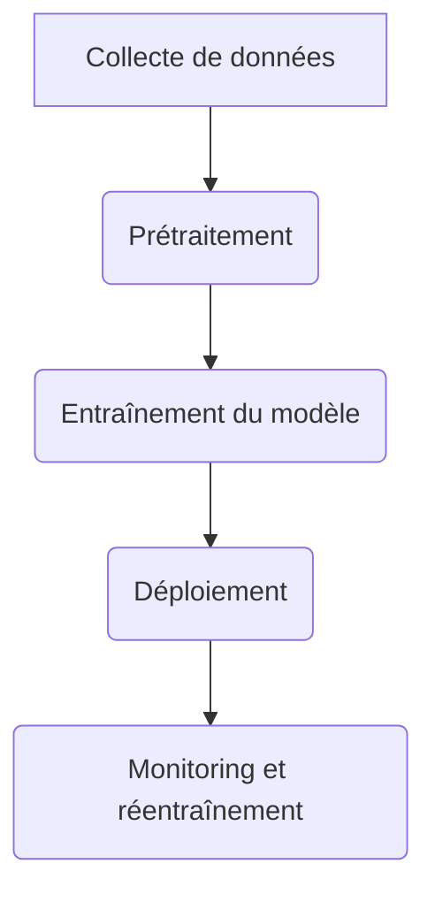

# Développement mutualisé d'une pipeline MLOps dans le cadre d'une application d'authentification par reconnaissance faciale & vocale

## Intention du projet

Ce projet vise à créer une synergie entre deux équipes travaillant sur des aspects complémentaires d'une pipeline MLOps. L'objectif est de mutualiser le développement d'une pipeline MLOps complète pour une application d'authentification par reconnaissance faciale et vocale. L'équipe 1 (HEIG-VD IAI) se concentrera sur la création d'un environnement de développement Data Science intégrant une pipeline MLOps de niveau 2. L'équipe 2 (Master TSM_MAchLeData) développera l'application d'authentification en mettant l'accent sur le réentraînement continu du modèle via une pipeline MLOps de niveau 3.

### Équipe 1 : HEIG-VD IAI

**Intention** :

L'idée est de créer un environnement de développement pour la Data Science, intégrant une pipeline MLOps. Cet environnement permettra de gérer des datasets, surveiller des entraînements, de déployer du code automatiquement dans un cadre semi-automatisé.

### Équipe 2 : Master TSM_MAchLeData

**Intention** :

L'idée est de développer un aspect d'une pipeline de MLOps dans le cadre d'un projet. Il s'agit donc de développer l'aspect de l'ingestion et réentraînement des données dans le cadre d'une application d'authentification par reconnaissance faciale & vocale.

## Objectif principal du projet (Livrable)

### Équipe 1 : HEIG-VD IAI

**Objectif** :

Simplifier et accélérer le processus de développement de modèles de machine learning en fournissant un environnement de développement complet pour la Data Science, intégrant une pipeline MLOps semi-automatisée.

**Critères d'évaluation** :

Le livrable sera évalué sur le gain de temps et la capacité de reproductions des expériences. Les critères d'évaluation incluront également: la facilité d'utilisation, la robustesse du système et les capacités d'automatisation.

**Valeur ajoutée** :

Le nouvel environnement de développement permettra de gagner du temps et de la reproductibilité dans le développement de nouveaux modèles de machine learning.

### Équipe 2 : Master TSM_MAchLeData

**Objectif** :

Le livrable sera une application permettant l'authentification par reconnaissance faciale et vocale, fonctionnant avec un pipeline MLOps entièrement fonctionnelle permettant l'entraînement continu d'un modèle de reconnaissance des personnes.

**Critères d'évaluation** :

Le livrable sera évalué sur la capacité à réentraîner automatiquement le modèle d'intelligence artificielle avec de nouvelles données.

**Valeur ajoutée** :

Le système est capable d'intégrer facilement de nouveaux utilisateurs et réentraîner automatiquement l'intelligence artificielle.

## Mission de l'équipe

### Équipe 1 : HEIG-VD IAI

Objectif : Développer un environnement de développement pour la Data Science, intégrant une pipeline MLOps complète.

### Équipe 2 : Master TSM_MAchLeData

Objectif : Développer une application d'authentification faciale & vocale qui développe un aspect dans la pipeline MLOps, spécifiquement le réentraînement des modèles sur de nouvelles données.

## Concept opérationnel

Phases :
Définition des besoins et des objectifs des deux équipes
Choix des technologies et des outils
Rédaction d'un rapport d'analyse du nouvel aspect de la pipeline MLOps
Développement de la pipeline MLOps, du modèle et de l'application

Parties prenantes :
Équipe 1 : Data Scientists, Développeurs
Équipe 2 : Data Scientists (modèle, analyse aspect), Développeurs (App), Data Engineers (pipeline MLOps)

## Architecture fonctionnelle

### Équipe 1 : HEIG-VD IAI

La pipeline de MLOps devra être de niveau 2 selon le modèle de maturité MLOps de microsoft.

Niveau 2: Entraînement automatisé
Training environment is fully managed and traceable
Easy to reproduce model
Releases are manual, but low friction

Automated model training
Centralized tracking of model training performance
Model management

### Équipe 2 : Master TSM_MAchLeData

La pipeline de MLOps devra être de niveau 3 selon le modèle de maturité MLOps de microsoft.

Niveau 3: Déploiement du modèle automatisé

Releases are low friction and automatic
Full traceability from deployment back to original data
Entire environment managed: train > test > production
Integrated A/B testing of model performance for deployment
Automated tests for all code
Centralized tracking of model training performance

### Architecture technique

Entraînement:
Keras avec backend PyTorch

Niveau 2:
MLFLOW : exp tracking, model registry
MinIO: Sauvegarde Artifacts, & Dataset
Kubeflow: orchestration du pipeline d'entraînement

Niveau 3:
KServe => déployment en prod du modèle
et les technos que Mag trouvera => réentraînement avec nouvelles data

## Work Breakdown Structure (WBS)

### Équipe 1 : HEIG-VD IAI

WP1 : Choix technologies niveau 2
WP2 : Développement pipeline MLOps niveau 2

### Équipe 2 : Master TSM_MAchLeData

WP1 : Choix technologies niveau 3
WP2 : Développement pipeline MLOps niveau 3
WP3 : Développement application
WP4 : Développement modèle
WP5 : Intégration pipeline MLOps modèle
WP6 : Intégration pipeline MLOps application
WP7 : Analyse aspect pipeline MLOps
WP8 : Intégration aspect pipeline MLOps
WP9 : Rédaction rapport final
WP10 : Présentation intermédiaire

## Phases du projet et milestones

Phase 1 : Définition des besoins et des objectifs
Phase 2 : Choix des technologies et des outils
Phase 3 : Rédaction du rapport d'analyse
Phase 4 : Développement de la pipeline MLOps
Phase 5 : Développement du modèle et de l'application

## Flux d'actions principales

Collecte de données → Prétraitement → Entraînement du modèle → Déploiement → Monitoring et réentraînement
Certaines étapes peuvent être parallélisées, comme le prétraitement et l'entraînement du modèle, une fois que les données sont prêtes.



## Diagramme de Gantt

```mermaid

gantt
    title Gantt Chart - MLOps Project

    dateFormat  YYYY-MM-DD
    axisFormat  %d-%m-%Y
    excludes    weekends, 2023-12-20, 2023-12-21, 2023-12-22, 2023-12-23, 2023-12-24, 2023-12-25, 2023-12-26, 2023-12-27, 2023-12-28, 2023-12-29, 2023-12-30, 2023-12-31, 2024-01-01, 2024-01-02
```

## Organisation de l'équipe

### Équipe 1 : HEIG-VD IAI

Olivier D'Ancona: Chef de projet, Choix des technologies, Développement pipeline MLOps
Arnaud Maillard: Choix des technologies, Développement pipeline MLOps

### Équipe 2 : Master TSM_MAchLeData

Olivier D'Ancona: Chef de projet, Choix des technologies, Développement pipeline MLOps
Badr Boucherine: Développement pipeline MLOps
Géraud Silvestri: Développement application
Yann Zübruck: Développement modèle
Magali Egger: Analyse aspect pipeline MLOps

## Méthodes et outils de gestion

Méthodes:
Kanban pour la gestion des tâches
Scrum pour les réunions et la planification

Outils:
GitHub pour le versionnage du code, modèle et rapport
Powerpoint pour les présentations

## Chiffrage des ressources

### Ressources humaines

Équipe 1 : 2 personnes à 100% pendant 8 semaines
Équipe 2 : 4 personnes à 100% pendant 8 semaines

### Ressources matérielles

Ordinateurs portables pour chaque membre de l'équipe
Crédits cloud pour le déploiement de certaines ressources critiques

### Estimation temps : 8 semaines pour le projet complet
